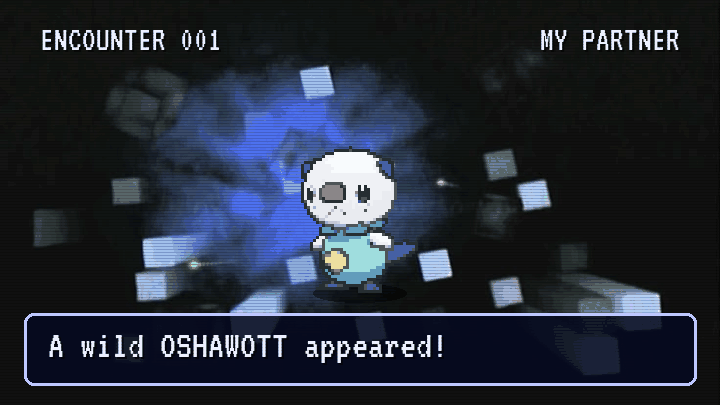

  

I'm a computer engineering student at the Federal University of Ceará, in Fortaleza, Brazil, graduating in 2027. I work on digital hardware and on how it fails: RTL in SystemVerilog, RISC-V systems-on-chip on FPGA, synthesis in Cadence Genus, and the Python that runs the test bench.

## Research

Since January 2025 I've been a research assistant at LESC, the computer systems lab at UFC, in a collaboration with IHP Microelectronics (Germany) on aging and radiation effects.

- On-chip aging sensors in SystemVerilog for the PULP Croc RISC-V SoC. They measure timing-slack loss through MMCM phase shifts, with instances in the core, the OBI crossbar, the bus demux and the UART.
- Radiation mitigation for a proton campaign at PARTREC, Groningen, in April 2026 (RADNEXT transnational access): configuration-memory scrubbing with the Xilinx SEM IP, BRAM ECC and a UART arbiter for the CPU, scrubber and telemetry streams. I ran the first night shift remotely from Fortaleza and wrote the campaign reports.
- Python and SCPI automation for burn-in between 33 and 125 °C, which cut each characterization campaign by about 40%.

The lab repositories are private. What's public is below.

## Papers

- A. J. S. Barros et al. A CEM43-Driven RTL Thermal Governor with Selective AXI4-Stream Throttle for Biomedical FPGA Wearables. IEEE LASCAS 2027, under review. First author.
- D. Alencar, A. Barros et al. Quantifying the Effect of Burn-In Thermal Control on Delivered Acceleration Factor and On-Chip Slack-Sensor Fidelity in an FPGA Target. IEEE SBCCI 2026. Invited for an extended version in IEEE Design & Test.
- L. Nogueira, M. Filho, D. Alencar, A. Barros et al. Auto-Tuning Aging Sensor Validated Under Burn-In, Temperature, and Voltage Variations. IEEE SBCCI 2025.

## Projects

Hardware and low level

- [8-bit-cpu-and-assembler-toolchain](https://github.com/alissonjsb4/8-bit-cpu-and-assembler-toolchain): 8-bit CPU with its own instruction set and a multi-cycle state-machine control unit, in Verilog, plus its assembler in C++. Team of four.
- [simple-os-x86](https://github.com/alissonjsb4/simple-os-x86): 16-bit operating system for x86 in Assembly, with bootloader, kernel and a text editor that saves to disk. Team of seven.
- [stm32-lora-telemetry-relay](https://github.com/alissonjsb4/stm32-lora-telemetry-relay): LoRa telemetry link for an RS41 radiosonde on STM32WL55 boards, with circular-DMA UART capture and checksum validation in a state machine.

Software and data

- [ecg-anomaly-detection](https://github.com/alissonjsb4/ecg-anomaly-detection): ECG anomaly detection trained only on normal beats. Mahalanobis distance and PCA written from scratch in NumPy, F1 0.944 and AUC 0.962, reproducible in 13 seconds.
- [esp32-license-plate-detection](https://github.com/alissonjsb4/esp32-license-plate-detection): license-plate detection with an INT8 MobileNetV1 running on an ESP32-S3. Training in Python, inference in C++ on the microcontroller. Team of four.
- [flight-watch](https://github.com/alissonjsb4/flight-watch): airfare monitor that runs unattended and only sends an alert when the price changes band.

## Elsewhere

I founded and chair the IEEE Circuits and Systems Society student chapter at UFC. Outside the lab I play competitive Pokémon (VGC), which is why there's a wild one at the bottom of this page.

alissonjsb4@gmail.com · [LinkedIn](https://www.linkedin.com/in/alissonjsb4)

## Catch one

<!-- pokemon:start -->

  

  <a href="https://github.com/alissonjsb4/alissonjsb4/issues/new?title=pokemon%7Cthrow&body=Just%20submit%20this%20issue.%20A%20GitHub%20Action%20plays%20the%20move%2C%20replies%20here%20and%20updates%20the%20profile%20in%20about%20a%20minute.">Throw a Poké Ball</a> &nbsp;·&nbsp; <a href="https://github.com/alissonjsb4/alissonjsb4/issues/new?title=pokemon%7Crun&body=Just%20submit%20this%20issue.%20A%20GitHub%20Action%20plays%20the%20move%2C%20replies%20here%20and%20updates%20the%20profile%20in%20about%20a%20minute.">Run</a>

Each link opens an issue with the move in the title. Submit it and a GitHub Action rolls the throw, replies in the issue and updates this page in about a minute. Poké Balls left for this one: 2.

0 caught, 0 fled, 1 Poké Ball thrown by 1 trainer. Sprites from PokéAPI.

<!-- pokemon:end -->
